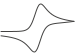

# Updating site content

The site uses Jekyll to generate static HTML for GitHub Pages. Entries are
ordered newest first and share reusable CSS classes from `assets/home.css`.

The five published pages are `index.html`, `publications.html`, `models.html`,
`talks.html`, and `service.html`. Each page contains only its own content and a
small YAML front matter block. Shared markup lives in:

- `_layouts/default.html`: document shell and page layout
- `_includes/header.html`: logo and navigation
- `_includes/site-notice.html`: optional dismissible page-status notice
- `_includes/profile.html`: portrait, affiliation, email, and profile links

Edit a shared file once to update every generated page. The `nav` value in a
page's front matter controls which navigation link is highlighted.
The notice's close behavior is defined in `assets/site.js`. Add
`work_notice: true` to a page's front matter to display it on that page.

## Models

Edit `models.html`. Each type of model is a full `text-section`, like the
sections on the About page. Individual designs are `model-subsection` sections
inside that category's `model-subsections` container.

```html
<section class="text-section model-category" aria-labelledby="category-name">
  <div class="section-heading">
    <h2 id="category-name">Category name</h2>
    <div class="heading-rule" aria-hidden="true">
      
    </div>
  </div>
  <div class="model-subsections">
    <section class="model-subsection" aria-labelledby="model-name">
      <h3 id="model-name">Model name</h3>
      <p class="model-description">Model description.</p>
      <!-- Add gallery links inside a model-gallery container. -->
    </section>
  </div>
</section>
```

Gallery previews are ordinary links with the `gallery-thumbnail` and
`data-gallery-thumbnail` attributes. JavaScript uses them to replace the large
`data-gallery-stage` image. Their link targets still open normally if
JavaScript is unavailable. Set `gallery: true` in the page front matter to
enable this behavior and the enlarged viewer with previous/next controls.
Store the visible large-image caption in each preview's
`data-gallery-caption` attribute; thumbnails themselves do not display text.
Each `model-gallery` is independent, so one page can contain as many galleries
as needed while sharing the same enlarged image viewer.
For a GLB preview, add `data-gallery-kind="model"` and point the thumbnail link
to the model file. Pages containing a 3D preview must also set
`model_viewer: true` in their front matter.

## Publications

Edit `publications.html`. Inside `<div class="publication-years">`, add a new
year section above the older years, or add an article at the top of an existing
year's `<div class="publication-entries">`.

```html
<section class="publication-year" aria-labelledby="year-2027">
  <h3 id="year-2027">2027</h3>
  <div class="publication-entries">
    <article class="publication-entry">
      <h4>Publication title</h4>
      <p>Author, A.; <strong>Hemmer, J. V.</strong>; Author, B.</p>
      <p class="publication-journal">
        <a href="https://doi.org/example"><em>Journal Name</em></a>
      </p>
    </article>
  </div>
</section>
```

## Talks and posters

Edit `talks.html`. Oral talks are in the first `presentation-group`; posters
are in the group headed **Posters**. Add a new `talk-year` when needed, or add
an entry at the top of an existing year's `talk-entries` container.

```html
<article class="talk-entry">
  <!-- Include this line only for a future presentation. -->
  <p class="talk-status">Upcoming</p>
  <h5 class="talk-event">Conference or meeting</h5>
  <p class="talk-title">Presentation title</p>
  <p>City, State or Country</p>
  <p>Month Day, Year</p>
</article>
```

The location and date automatically use the standardized tight spacing.

## Education

Edit `index.html`. Add entries inside `<div class="education-list">`.

```html
<article class="education-entry">
  <div>
    <h3>
      <span class="education-title">
        <span class="education-degree">Degree:</span>
        <span class="education-field">Field</span>
      </span>
      <span class="education-year">Completion year</span>
    </h3>
    <p class="entry-institution">
      Institution, <span class="institution-country">Country</span>
    </p>
    <p class="education-thesis">Thesis: Thesis title</p>
    <p>Advisor: Name, Ph.D.</p>
  </div>
</article>
```

Omit the thesis line when it is not applicable. Use `Present` for an ongoing
degree. Country names are displayed in muted italics.

## Scientific notation

Use HTML subscripts when helpful: `CO<sub>2</sub>` renders as CO₂.

## Service and outreach

Edit `service.html`. Add journals to `journal-list`, and add outreach activities
to `outreach-list` in newest-first order.

```html
<article class="outreach-entry">
  <h3>Role</h3>
  <p class="outreach-title">Activity title, when applicable</p>
  <p>Organization and location</p>
  <p>Month Day, Year</p>
</article>
```

## Preview

Install Ruby, Bundler, and the platform prerequisites first. On Ubuntu, the
[official Jekyll guide](https://jekyllrb.com/docs/installation/ubuntu/)
recommends `ruby-full`, `build-essential`, and `zlib1g-dev`. Then install the
project dependencies once:

```bash
bundle config set --local path vendor/bundle
bundle install
```

Then start the local preview server:

```bash
bundle exec jekyll serve --livereload
```

Open `http://127.0.0.1:4000/`. Jekyll rebuilds the generated `_site` directory
when source files change; `--livereload` also refreshes the browser.

`python3 -m http.server` can still serve the generated `_site` directory, but
it cannot process Liquid includes or layouts directly.
